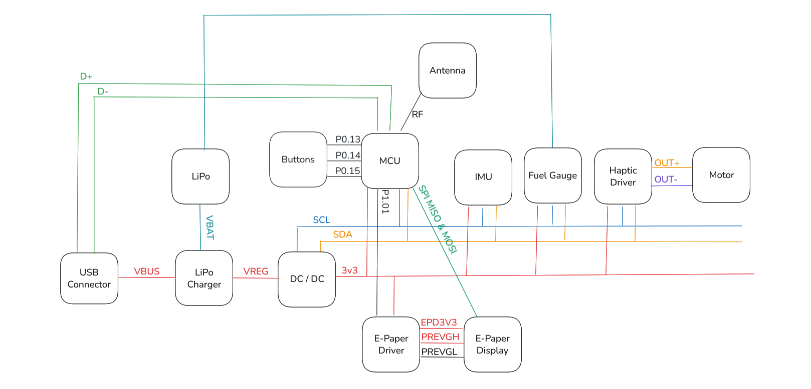

# Ink Time 
##### Nicolae-Cristian Macovei, 332CA

## Short Description

Ink-Time is a prototype open-source watch, designed to operate on low power and provide a unique experience with an e-paper display.

## Block Diagram

## Hardware Description

### Microcontroller (nRF52840)

- CPU: 32-bit ARM® Cortex®-M4 with a hardware Floating Point Unit (FPU) running at 64 MHz.
- Memory: 1 MB of on-chip Flash and 256 KB of RAM
- Connectivity: SPI, I2C, BLE, USB, 48 GPIO pins

### Power Distribution

##### Battery & Charger

The watch has a 250mAh onboard LiPo battery providing 3.7V when fully charged. The battery can be charged via USB-C at 5V, using the *BQ2518YBGR* charger. 

##### Voltage Regulator

To ensure a stable 3.3V, power coming from the charger's `SYS` pin to the entire system is passed through a DC/DC converter (*RT6160*)

##### Fuel Gauge

The information about the battery's charge is sent to the microcontroller via I2C by the Fuel Gauge *MAX17047G* circuit.

### Display

##### E-Paper Display Driver

Since the e-Paper Display operates at a higher voltage than 3V3, it needs a dedicated driver circuit to power it. This circuit uses two transistors (*DMG2305UX-7* and *SI1308EDL*), three diodes (*MBR0530*) and a LC filter to generate power for the E-Paper Display.

##### E-Paper Display

The display used in this watch is a 1.5 inch e-Paper Display, connected via a *503480-0540 Molex* connector. This display connects directly to the MCU via SPI.

### User Interface & Connectivity

##### BLE 

The watch has an antenna chip (*2450AT18B100E*) capable of BLE communication, connected directly to the microcontroller via GPIO.

##### Buttons & Haptic Driver

The watch also features three buttons on the side with programmable functionality, and a small shaker motor connected with a haptic driver via I2C.

## nRF52840 Pinout

- P0.00, P0.01: Connected to `X2`
- P0.05: `CS` for e-Paper SPI
- P0.06: `SDA` for I2C Bus
- P0.07: `SCL` for I2C Bus
- P0.08, P1.08: IMU interrupts
- P0.11: PMIC interrupts
- P0.12: `HAPTIC_EN`
- P0.13: `SW_UP` Button
- P0.14: `SW_ENT` Button
- P0.15, P0.16, P0.17: connections to e-Paper Display
- P1.00: `SWO`
- P1.01: e-Paper Driver, Gate of Q1
- P1.02: `SW_DN` Button
- P0.10: `ALERT`
